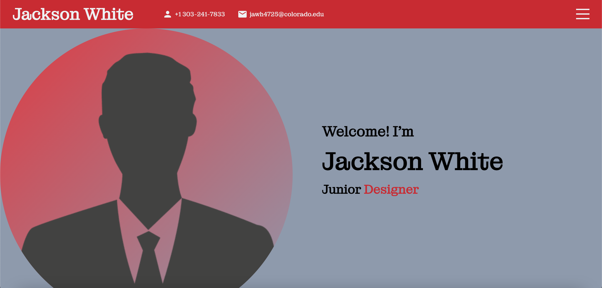

# React Portfolio

## React Portfolio Description

This application is designed to showcase my projects and abilities through the usage of a React portfolio. I did not implement a mobile-friendly UI yet, but plan to in the future. Another planned update is to change the footer tab slightly to look a tad cleaner. I would also like to add more animations.

I'd also like to give credit to Lama Dev (https://www.youtube.com/watch?v=7WwtzsSHdpI&ab_channel=LamaDev) for some design inspirations. Thanks!

## Using application

To use this application, visit the deployed application: http://JacksonWhite4725.github.io/react-portfolio

## Installing application

No need to install, but feel free to clone the code source.